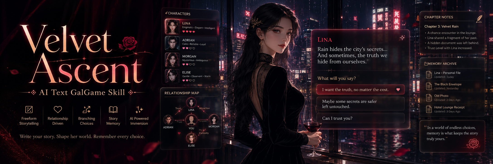

<p align="center">
  
</p>

<h1 align="center">Velvet Ascent Skill</h1>

<p align="center">
  成人向 AI 文字 GalGame 引擎，为支持 skills 的 AI Agent 提供高自由、回合制、自然升温的互动剧情 GM。
</p>

<p align="center">
  <a href="https://www.npmjs.com/package/@ruizhefeng/velvet-ascent-skill">
    
  </a>
  <a href="LICENSE">
    
  </a>
  
  
</p>

<p align="center">
  <b>AI Agent skill</b> · <b>成人向文字游戏</b> · <b>自由 GalGame</b> · <b>中文互动小说</b> · <b>文字冒险</b> · <b>故事记忆</b> · <b>小说导出</b>
</p>

---

## 项目定位

`velvet-ascent` 是一个面向支持 skills 的 AI Agent 的中文成人向文字游戏 GM skill。它把 AI 对话变成一个更自由的文字版 GalGame：玩家可以用自然语言指定世界观、主角身份、人物关系、剧情尺度、行动路线和长期记忆方式。

它追求的是“自然升温”的成人向剧情推进，而不是开局失控的堆料。前期以吸引力、机缘、情绪铺垫和关系暗流为主；中期让玩家选择推动人物关系和冲突；后期在已有伏笔上展开更强的剧情张力、关系竞争、系统成长和多线故事。

## 核心能力

| 能力 | 说明 |
|---|---|
| 自然升温 | 前期温和铺垫，中后期根据选择、关系和阶段自然增强张力。 |
| 高自由回合制 | 支持选项推进，也支持玩家随时输入自定义行动。 |
| 成人向互动剧情 | 类似自由 GalGame，以成年角色、关系推进和剧情后果为核心。 |
| 关系网追踪 | 维护 NPC 动机、好感、信任、竞争、误会、承诺和隐藏伏笔。 |
| 多文档记忆 | 将长期游戏拆成世界观、人物、关系、回合、章节等文档，降低遗忘。 |
| 小说导出 | 将完整游戏过程整理为连续小说草稿，保留主线、关系变化和结局。 |
| npx 安装 | 通过 npm 发布，一条命令安装到本地 skills 目录。 |

## 安装

```powershell
npx @ruizhefeng/velvet-ascent-skill
```

默认安装到：

```text
~/.agents/skills/velvet-ascent
```

如果你的 Agent 客户端使用不同的 skills 目录，可以指定安装路径：

```powershell
npx @ruizhefeng/velvet-ascent-skill --target C:\Users\YourName\.agents\skills
```

安装后如果 Agent 没有立刻识别到 skill，重启客户端或重新加载 skills。

## 快速开始

现代都市自然流：

```text
开一个现代都市题材的自然流YY文字游戏，主角普通青年，想要爽文方向，但开局要温和自然一点。
```

玄幻宗门成长线：

```text
主题玄幻宗门，主角是刚入门的外门弟子。我要高度自由，后期可以有后宫争宠，但前几回合先从吸引力和机缘开始。
```

长期剧情记忆：

```text
开启文档记忆模式。以后每回合都帮我整理故事文档，人物关系别忘。当前游戏结束后我要导出成完整小说。
```

## 回合体验

每个普通回合会围绕当前身份、状态变化、核心事件、随机事件和行动选项展开：

```text
【标题】
当前身份：普通青年·异变初醒

【当前状态】
魅力：略有提升 | 声望：平静日常 | 阶段：温和自然

【核心事件】
你在电梯里遇到那位熟悉的女邻居。她注意到你今天的变化，语气比往常多了一点柔和和试探。

【随机事件】
隔壁新搬来的女孩正在搬行李。她看上去有些疲惫，却仍然礼貌地向你点头。

【行动选项】
1. 和女邻居多聊几句，试探她今天的态度。
2. 主动帮新邻居搬行李，留下自然可靠的印象。
3. 回房间研究身体和精神变化。
4. 自定义行动：...
```

## 游戏内命令

| 命令 | 作用 |
|---|---|
| `查看系统面板` | 查看主角状态、阶段和关键属性。 |
| `查看关系网` | 查看当前重要 NPC 的关系状态。 |
| `查看后宫状态` | 在关系自然形成后查看多线关系局势。 |
| `提高尺度` / `降低尺度` | 调整剧情强度和表达直白程度。 |
| `阶段总结` | 总结近期关系、能力、冲突和下一阶段方向。 |
| `保存本回合` | 保存当前回合记录。 |
| `整理故事文档` | 更新世界观、人物、关系和伏笔文档。 |
| `导出小说` | 将游戏过程整理为连续小说草稿。 |
| `自定义行动：...` | 执行玩家自定义行动。 |

## 文档记忆系统

开启文档记忆后，skill 会按职责拆分故事资料，避免长期游戏中人物关系和伏笔被遗忘：

```text
velvet-ascent-runs/
  <game-slug>/
    00-game-bible.md
    01-protagonist.md
    02-character-ledger.md
    03-relationship-web.md
    04-plot-threads.md
    turns/
      turn-001.md
      turn-002.md
    chapters/
      chapter-001.md
    exports/
      novel-draft.md
```

## 适用场景

- 想让支持 skills 的 AI Agent 长期扮演中文文字游戏 GM。
- 想玩自由度高、回合推进、选择影响后续剧情的文字冒险。
- 想创建成人向、GalGame 风格、但比固定选项游戏更自由的 AI 对话剧情。
- 想让故事具备人物记忆、关系连续性和最终小说导出能力。

## 不适合

- 只想要一次性短篇故事。
- 不需要持续状态、人物关系或多回合推进。
- 想跳过铺垫，直接生成无上下文的极端内容。

## 仓库结构

```text
.
├── SKILL.md              # skill 元数据和运行规则
├── bin/install.js        # npx 安装器
├── assets/               # README 封面和可选素材
├── references/           # 长参考文档目录
├── scripts/              # 可选辅助脚本目录
├── evals/evals.json      # 开发测试用例，不随 npm 包安装
├── package.json          # npm 包元数据
├── README.md             # 项目说明
└── LICENSE               # MIT 许可证
```

## 本地开发

验证安装器：

```powershell
node bin\install.js --help
node bin\install.js --target .\tmp-skills
```

预览 npm 发布内容：

```powershell
npm pack --dry-run
```

`evals/` 目录用于开发测试，不会包含在最终 npm 安装包里。

## 发布

更新 `package.json` 里的版本号后发布：

```powershell
npm publish --access public
```

如果 npm 要求双因素认证，按终端提示完成浏览器验证或输入 OTP。

## 内容边界

这个 skill 面向虚构的成人文字冒险。它强调自然推进、成年角色、合意互动和故事后果，不用于生成未成年、非自愿、剥削性或违法性内容。

## License

MIT

